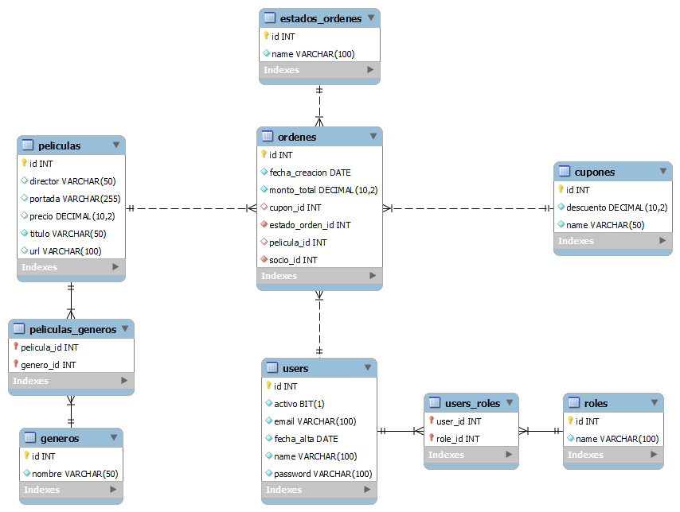

# Proyecto Integrador Final
## Bootcamp Java Developer - EducacionIT

### PELISFLIX
E-commerce que permite administar y gestionar Películas almacenadas en una base de datos. El sistema back-end permite controlar la totalidad de sus funciones a través de Servicios REST. Cuenta con:
- Administrador de Películas
- Administrador de Géneros
- Autenticación de Usuarios
- Administrador de Órdenes
- Administrador de Cupones
- Administrador de Estados de Órdenes

En la información de Películas se puede observar:
- Título
- Géneros asociados
- Director
- URL a sitio oficial
- Imagen promocional
- Precio

### Tecnologías utilizadas
- Java 17 - Maven - MySQL - API REST - Hibernate - Spring - Spring Security - Swagger- Thymeleaf - Lombok - JJWT - Git

API REST: http://localhost:8080/swagger-ui/index.html#/

### Ejecutar
1- Configurar la base de datos en el archivo application.properties. A través del script.sql solamente crear la base de datos.
2- Ejecutar src/tests/java/com/educacionit/utils/SecreteKeyUtil. Copiar el valor de la clave y ubicarlo en la clase JwtService.
3- Ejecutar src/main/java/com/educacionit/DesafioIntegradorFinalApplication.
4- Insertar los datos a través del script.sql.

### Usuarios/Password:
Administrador: admin@pelisflix.com - admin
Socio: socio@pelisflix.com - socio

### Autor del Proyecto
- Emmanuel Greco [LinkedIn](https://www.linkedin.com/in/emmanuel-antonio-greco-689691b7/)